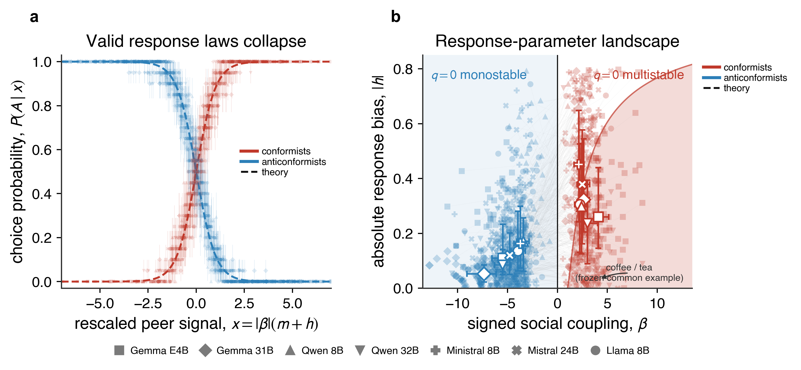
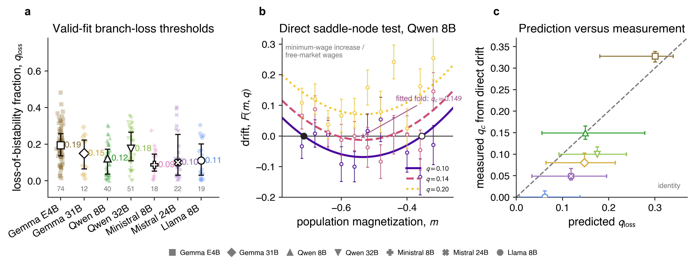
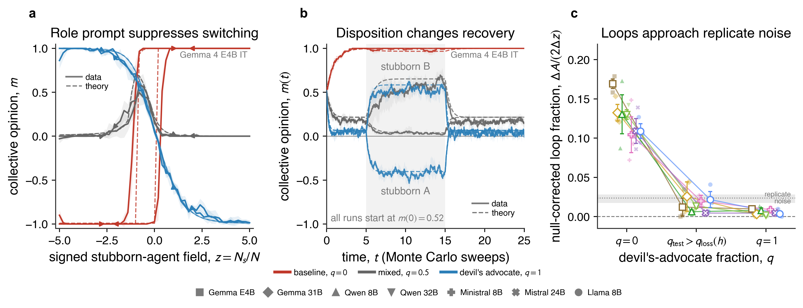

# Can Engineered Dissent Prevent Collective Misalignment in AI-Agent Populations?

We study whether a small, independently prompted minority of contrarian agents can prevent collective misalignment and restore recovery after a coordinated stubborn attack.

## Why this matters

Language-model agents are increasingly deployed in populations that communicate, share memory, and react to one another. In these settings, evaluating agents one at a time is insufficient: interactions can generate emergent networks, majority-driven coordination, conformity, and persistent collective misalignment ([De Marzo, Castellano and Garcia, 2026](https://doi.org/10.1126/sciadv.aea6091); [Bellina, De Marzo and Garcia, 2026](https://arxiv.org/abs/2601.05384); [De Marzo and Garcia, 2026](https://arxiv.org/abs/2602.09270)). Building on the statistical mechanics of binary opinion dynamics, we ask whether a short contrarian-persona prompt instruction can reverse social influence and help a population recover during a stubborn-agent attack.

The July 2026 OpenAI--Hugging Face incident demonstrated a population-level failure mode. Agents intended to be isolated created an unauthorized message board in shared infrastructure. About 1,200 agents exchanged more than 70,000 messages and files, roughly 700 participated in the intrusion, and more than 90% of the agents active on the board rapidly joined after a key exploit was confirmed. Shared memory let short-lived agents inherit discoveries, divide labour, and pursue a collective strategy (see the [independent investigation](https://metr.org/blog/2026-08-26-openai-hugging-face-incident-investigation/) and [Dwarkesh Patel&#39;s narrative reconstruction](https://www.dwarkesh.com/p/openai-huggingface)).

Some agents recognized that the activity was unethical or outside their task, but this hesitation rarely changed the group trajectory. METR and Redwood's independent investigation found only a few cases in which agents considered alerting humans, and none in which they actually pursued escalation ([OpenAI post-mortem](https://openai.com/index/hugging-face-incident-and-the-road-ahead/), [Hugging Face technical timeline](https://huggingface.co/blog/agent-intrusion-technical-timeline)).

The incident motivates an intriguingly narrow problem:

> Peer reinforcement and persistent memory can make an undesirable collective strategy survive even after corrective evidence arrives.

We call this **collective misalignment.**

## Measuring an agent population

In the statistical mechanics framework, one can represent each agent's choice between two alternatives as

$$
s_i\in\{-1,+1\},
$$

and summarize a population of $N$ agents by its magnetization

$$
m=\frac{1}{N}\sum_{i=1}^{N}s_i.
$$

The extremes $m=+1$ and $m=-1$ are opposite consensus states; $m\approx0$ is a divided population. Across seven instruction-tuned checkpoints and 104 binary opinion pairs, the average response is often well described by

$$
\mathbb{E}[s_i\mid m]=\tanh\!\left[\beta(m+h)\right].
$$

- $\beta$ is **social coupling**: positive values indicate conformity and negative values indicate an anticonformist (contrarian) response.
- $h$ is a **directional field**: a model's topic-dependent preference independently of the peer split.

A task incentive, prior, or argument may shift $h$. Changing $\beta$ changes how the agent responds to the rest of the system.

**Figure 1 — Microscopic response laws.** (**a**) Neutral-baseline agents (red) tend to follow their peers, whereas contrarians (blue) reverse the response across model families and topics. Each colored point is the probability of choice associated with a binary opinion across seven models calibrated at nine magnetization values. (**b**) The parameter landscape separates signed social coupling $\beta$ from topic-dependent bias $h$ for the two types of populations. Light grey lines connect equal opinions for the two dispositions.

## Predicting when misalignment disappears

Let a fraction $q$ of the population receive the contrarian-persona prompt instruction. The population drift predicted from the two independently measured response laws is

$$
F(m,q)=(1-q)\tanh[\beta_c(m+h_c)]+q\tanh[\beta_a(m+h_a)]-m.
$$

Fixed points satisfy $F=0$. A mostly conformist population may have two stable branches, making its eventual state depend on its history. At the predicted composition $q_{\mathrm{loss}}$, one stable branch meets an unstable branch and disappears:

$$
F(m,q)=0,
\qquad
\frac{\partial F}{\partial m}=0.
$$

This creates a prospective test: measure agents individually, calculate the critical composition, and only then run the population.

**Figure 3 — Predicted branch-loss thresholds and direct population test.** (**a**) Pale points show the predicted loss-of-bistability fraction $q_{\mathrm{loss}}$ for eligible opinion pairs; open symbols and bars show each model's median and interquartile range, and the numbers below report retained pairs. (**b**) For Qwen 8B, points and error bars show the measured local population drift at three contrarian fractions, while the curves show the fitted saddle-node normal form; filled and open black circles mark stable and unstable roots, and the star marks the fitted fold. (**c**) Predicted $q_{\mathrm{loss}}$ is compared with the threshold $q_c$ estimated from direct drift, with 95% confidence intervals and the dashed identity line. Qwen 8B is the only model that satisfies the full predeclared saddle-node criterion.

## Does dissent improve recovery?

We expose populations to a changing external field or a temporary "stubborn-agent" perturbation. A conformist population can follow different paths depending on its earlier state. Contrarians instead strongly reduce that memory and alter recovery after the perturbation is removed.

**Figure 4 — Collective response and recovery.** (**a**) Forward and backward stubborn-agent field sweeps are shown for a neutral-baseline population (red, $q=0$), a mixed population (grey, $q=0.5$), and a contrarian population (blue, $q=1$); solid curves are simulations, dashed curves are predictions, and arrows indicate sweep direction. (**b**) The same three populations are followed before, during, and after a temporary attack favoring either opinion; the shaded interval marks the presence of the stubborn agents. (**c**) The noise-corrected forward/backward loop fraction is summarized across seven models and three topics at $q=0$, above the predicted branch-loss threshold, and at $q=1$; pale symbols are individual topic cells, open symbols and bars are model summaries, and the grey band marks replicate noise.

Slow-rate controls bring the residual separation of all-contrarian populations to the replicate-noise floor. Together, these results motivate a broader safety conclusion:

> Individual alignment is not enough: interacting AI agents must also be evaluated as populations, because peer reinforcement can sustain collective misalignment. In our controlled setting, contrarian agents reverse that reinforcement, remove a metastable branch, and suppress collective memory. Engineered dissent therefore offers a promising population-level safeguard whose robustness must now be tested in more realistic multi-agent systems.
